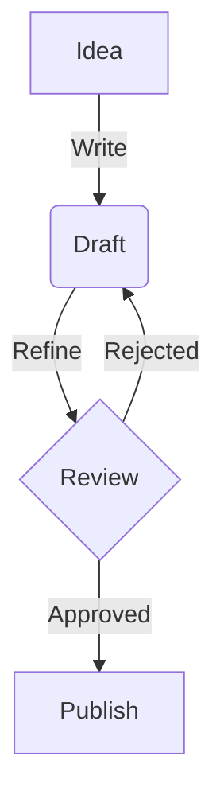

Lithos is designed to be fully compatible with [Obsidian](https://obsidian.md), ensuring that your existing vault works seamlessly without modification. We support standard Markdown, specific Obsidian extensions, and even some popular community plugins.

## Linking Your Knowledge

Connecting your notes is the core of the Obsidian philosophy. Lithos interprets your connections just like Obsidian does, creating a navigable web of information for your readers.

### Wikilinks

The most recognizable feature of Obsidian is the **Wikilink**. Instead of standard Markdown links like `[Link Text](path/to/file.md)`, you can simply use double brackets.

**Syntax:**
```md
- [[obsidian-syntax|Obsidian Syntax]]
- [[graph|Graph View]]
```

**Result:**
- [[obsidian-syntax|Obsidian Syntax]]
- [[graph|Graph View]]

Lithos resolves these links at build time, ensuring that even if you move files around (and update the links in Obsidian), your published site remains broken-link free. We handle index files, case sensitivity, and file extensions automatically.

### Embeds

You can embed notes, images, or even blocks of text directly into another note using the syntax `![[Note]]`.

**Syntax:**
```md
![[Feature Image.png]]
```

**Result:**

![[Feature Image.png]]

This allows you to compose complex documents from smaller, atomic notes, adhering to the principle of reusability and modularity in knowledge management.

### Backlinks and Graph

Every page in Lithos automatically tracks its **backlinks**—references from other pages. You can enable a footer section to display "Linked Mentions," helping readers discover related context. Combined with the [[Interactive Graph]], this creates a rich exploratory experience.

## Visualizing Information

Text isn't the only way to convey ideas. Lithos supports robust visualization tools native to the Obsidian ecosystem.

### Mermaid Diagrams

We include native support for [Mermaid.js](https://mermaid.js.org/), allowing you to create flowcharts, sequence diagrams, Gantt charts, and class diagrams using simple text.

**Syntax:**
~~~md

~~~

**Result:**


Simply wrap your Mermaid code in a `mermaid` code block, and Lithos renders it as an interactive SVG. This is perfect for documenting workflows, software architecture, or project timelines directly within your notes.

### Callouts

Obsidian Callouts (or Admonitions) are fully supported. Use them to highlight important information, warnings, or tips.

**Syntax:**
```md
> [!NOTE]
> This is a standard note callout.

> [!WARNING] Custom Title
> You can add a custom title after the type.

> [!TIP]
> Here is a helpful tip.

> [!CAUTION]
> Proceed with caution.
```

**Result:**

> [!NOTE]
> This is a standard note callout. It helps organize information visually.

> [!WARNING] Title with **Markdown**
> You can even use Markdown inside the title or the body of the callout!

> [!TIP]
> Here is a helpful tip for your users.

> [!CAUTION]
> Proceed with caution in this area.

We support all standard types: `note`, `abstract`, `info`, `todo`, `tip`, `success`, `question`, `warning`, `failure`, `danger`, `bug`, `example`, and `quote`.

### Math and LaTeX

For technical documentation, Lithos integrates [KaTeX](https://katex.org/) to render mathematical notation.

**Syntax:**
```md
$$
\int_{-\infty}^{\infty} e^{-x^2} dx = \sqrt{\pi}
$$
```

**Result:**

$$
\int_{-\infty}^{\infty} e^{-x^2} dx = \sqrt{\pi}
$$

This ensures your research papers, engineering notes, and academic content look professional and follow scientific standards.

## Content Organization

Structuring your vault effectively translates directly to a better reader experience on your published site.

### Frontmatter (Properties)

Lithos reads the YAML frontmatter at the top of your markdown files.
- `title`: Overrides the filename as the page title.
- `description`: Used for SEO and page summaries.
- `tags`: Adds standard tags that can be queried.
- `icon`: Sets a custom icon for the navigation sidebar.

```yaml
---
title: My Custom Title
description: A custom description for SEO.
tags: [feature, important]
icon: i-lucide-star
---
```

### Folder Structure

Your folder structure becomes your navigation menu.
- **Ordering**: You can prefix files with numbers (e.g., `1. Introduction.md`) to control their order in the sidebar. Lithos automatically strips these numbers from the URL and display title.
- **Index Files**: Place an `index.md` inside a folder to create a landing page for that section.

### Tags and Metadata

Tags in Obsidian (e.g., `#feature`) are parsed and indexed. You can use them to create filtered lists of content using our [[Structured Data]] components. For example, you could dynamically list all pages tagged `#blog` on your homepage.

